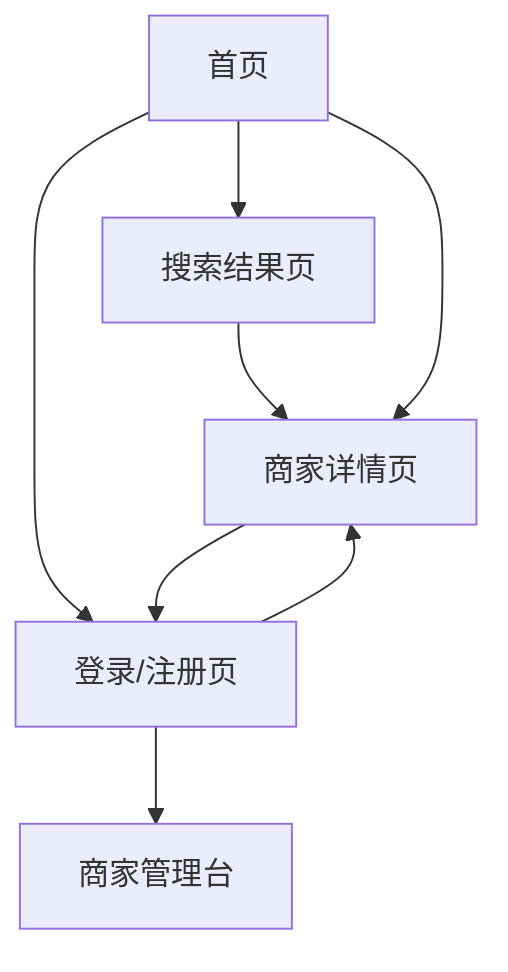

## 1. Product Overview
面向本地生活场景的“简化版大众点评”原型：用户可搜索商家、查看详情与评价并发布评价；商家可入驻并维护信息。
解决“找店/选店/看口碑”的基础需求，支持最小可用闭环。

## 2. Core Features

### 2.1 User Roles
| 角色 | 注册方式 | 核心权限 |
|------|----------|----------|
| 访客 | 无需注册 | 搜索与浏览商家/评价 |
| 用户 | 邮箱+密码注册/登录 | 发布/删除自己的评价；管理个人信息 |
| 商家 | 邮箱+密码注册后申请成为商家（或后台标记） | 创建/编辑自己的商家页；查看自己的评价列表 |
| 管理员(可选) | 预置账号 | 审核商家入驻；处理举报/违规评价（原型可先不做 UI） |

### 2.2 Feature Module
我们的原型由以下页面构成：
1. **首页**：搜索入口、热门/推荐商家列表、登录入口。
2. **搜索结果页**：关键词搜索结果、基础筛选/排序、结果列表。
3. **商家详情页**：商家信息、评价列表、发布评价。
4. **登录/注册页**：邮箱密码登录注册、退出登录。
5. **商家管理台**：商家资料编辑、门店信息维护、查看评价。

### 2.3 Page Details
| Page Name | Module Name | Feature description |
|-----------|-------------|---------------------|
| 首页 | 顶部导航 | 显示 Logo、搜索框入口、登录/个人中心入口 |
| 首页 | 推荐商家 | 展示推荐/热门商家卡片；点击进入商家详情 |
| 搜索结果页 | 搜索与筛选 | 支持关键词检索；筛选（分类/区域可选其一）；排序（评分/热度） |
| 搜索结果页 | 结果列表 | 展示商家卡片（封面、名称、分类、均分、评价数、地址简写） |
| 商家详情页 | 商家信息 | 展示名称、封面、分类、地址、营业时间（可选）、均分与评价数 |
| 商家详情页 | 评价列表 | 分页/加载更多；显示评分、正文、作者、时间 |
| 商家详情页 | 发布评价 | 登录用户可提交评分(1-5)+文本；提交后刷新列表；仅允许删除自己的评价 |
| 登录/注册页 | 认证 | 邮箱+密码注册/登录；登录态持久化；退出登录 |
| 商家管理台 | 商家资料维护 | 创建/编辑商家（名称、分类、地址、封面图 URL/上传可二选一、简介） |
| 商家管理台 | 评价查看 | 查看与自己商家关联的评价列表（只读） |

## 3. Core Process
- 访客流：打开首页 → 输入关键词 → 浏览搜索结果 → 进入商家详情 → 查看评价。
- 用户流：登录/注册 → 搜索并进入商家详情 → 发布评分与评价 → 在商家详情中删除自己的评价。
- 商家流：登录 → 进入商家管理台 → 创建/编辑商家资料 → 公开后被搜索到 → 在管理台查看评价。

