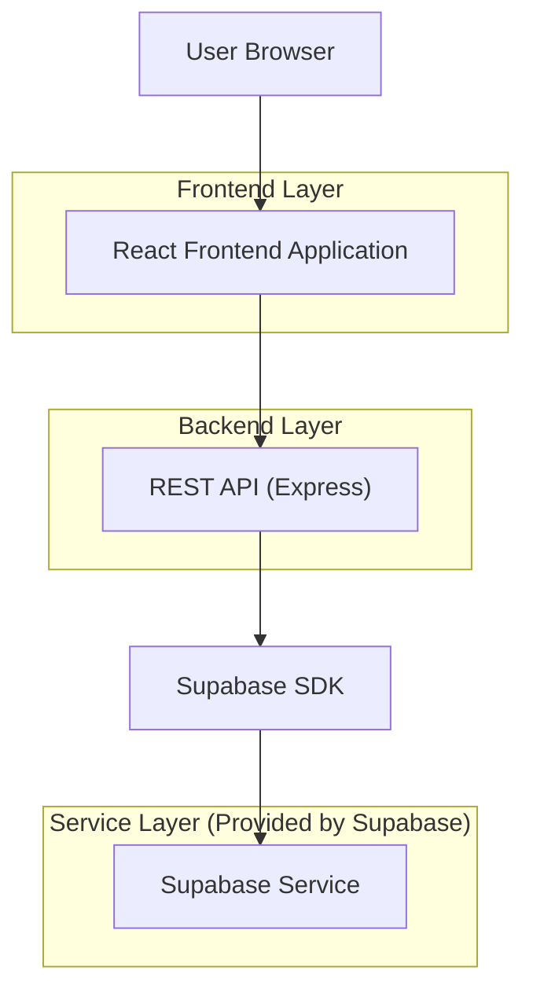
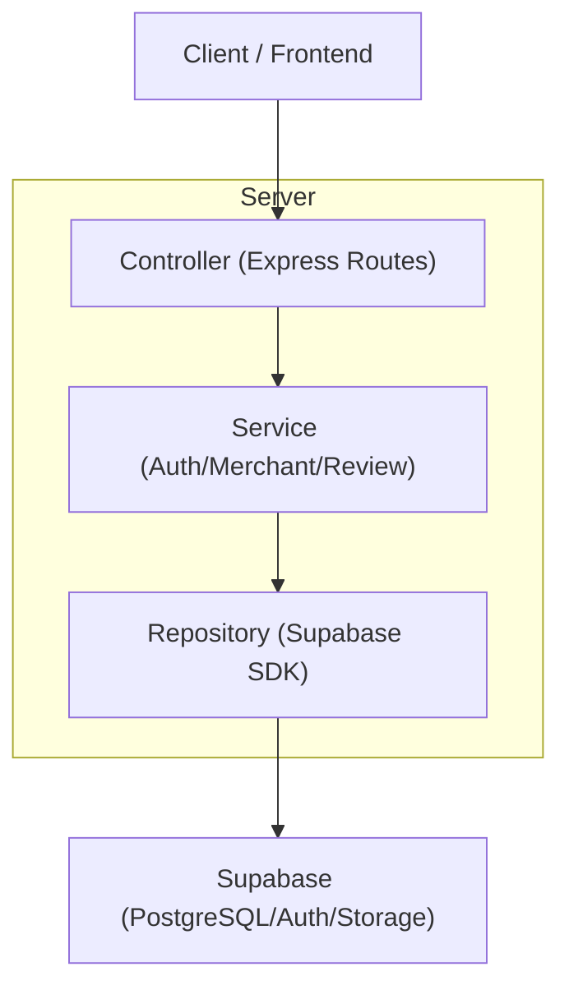
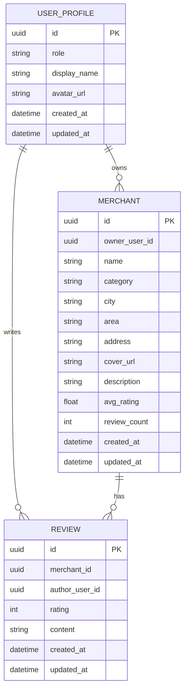

## 1.Architecture design


## 2.Technology Description
- Frontend: React@18 + react-router + tailwindcss@3 + vite
- Backend: Node.js + Express@4 (REST API)
- Backend SDK: @supabase/supabase-js
- Database: Supabase (PostgreSQL)
- Storage(可选): Supabase Storage（商家封面图）

## 3.Route definitions
| Route | Purpose |
|-------|---------|
| / | 首页：搜索入口、推荐商家 |
| /search | 搜索结果页：筛选/排序/列表 |
| /merchant/:id | 商家详情页：信息+评价+发评价 |
| /auth | 登录/注册页 |
| /merchant-admin | 商家管理台 |

## 4.API definitions (If it includes backend services)

### 4.1 Shared TypeScript Types
```ts
export type UserRole = 'user' | 'merchant' | 'admin'

export type Merchant = {
  id: string
  ownerUserId: string
  name: string
  category: string
  city?: string
  area?: string
  address: string
  coverUrl?: string
  description?: string
  avgRating: number
  reviewCount: number
  createdAt: string
  updatedAt: string
}

export type Review = {
  id: string
  merchantId: string
  authorUserId: string
  rating: number // 1-5
  content: string
  createdAt: string
  updatedAt: string
}
```

### 4.2 Core REST API
Auth
- `POST /api/auth/register`（email, password）
- `POST /api/auth/login`（email, password）
- `POST /api/auth/logout`
- `GET /api/me`（返回当前用户信息）

Merchants
- `GET /api/merchants`（q?, category?, area?, sort=rating|hot, page, pageSize）
- `GET /api/merchants/:id`
- `POST /api/merchants`（商家角色）
- `PUT /api/merchants/:id`（仅 owner）

Reviews
- `GET /api/merchants/:id/reviews`（page, pageSize）
- `POST /api/merchants/:id/reviews`（登录用户）
- `DELETE /api/reviews/:id`（仅作者）

Response（统一）
```ts
export type ApiResp<T> = { ok: true; data: T } | { ok: false; error: { code: string; message: string } }
```

## 5.Server architecture diagram (If it includes backend services)


## 6.Data model(if applicable)

### 6.1 Data model definition


### 6.2 Data Definition Language
User Profile（user_profiles）
```sql
CREATE TABLE user_profiles (
  id UUID PRIMARY KEY,
  role VARCHAR(20) NOT NULL DEFAULT 'user',
  display_name VARCHAR(60),
  avatar_url TEXT,
  created_at TIMESTAMPTZ NOT NULL DEFAULT NOW(),
  updated_at TIMESTAMPTZ NOT NULL DEFAULT NOW()
);

CREATE TABLE merchants (
  id UUID PRIMARY KEY DEFAULT gen_random_uuid(),
  owner_user_id UUID NOT NULL,
  name VARCHAR(80) NOT NULL,
  category VARCHAR(40) NOT NULL,
  city VARCHAR(40),
  area VARCHAR(40),
  address VARCHAR(120) NOT NULL,
  cover_url TEXT,
  description TEXT,
  avg_rating REAL NOT NULL DEFAULT 0,
  review_count INT NOT NULL DEFAULT 0,
  created_at TIMESTAMPTZ NOT NULL DEFAULT NOW(),
  updated_at TIMESTAMPTZ NOT NULL DEFAULT NOW()
);
CREATE INDEX idx_merchants_search ON merchants (name, category, city, area);
CREATE INDEX idx_merchants_owner ON merchants (owner_user_id);

CREATE TABLE reviews (
  id UUID PRIMARY KEY DEFAULT gen_random_uuid(),
  merchant_id UUID NOT NULL,
  author_user_id UUID NOT NULL,
  rating INT NOT NULL CHECK (rating BETWEEN 1 AND 5),
  content VARCHAR(1000) NOT NULL,
  created_at TIMESTAMPTZ NOT NULL DEFAULT NOW(),
  updated_at TIMESTAMPTZ NOT NULL DEFAULT NOW()
);
CREATE INDEX idx_reviews_merchant_created ON reviews (merchant_id, created_at DESC);
CREATE INDEX idx_reviews_author ON reviews (author_user_id);

-- 权限（原型默认策略；实际生产建议配合 RLS 策略细化）
GRANT SELECT ON user_profiles, merchants, reviews TO anon;
GRANT ALL PRIVILEGES ON user_profiles, merchants, reviews TO authenticated;
```

## 7.交付物（部署/交付清单）
- 前端：`/apps/web`（Vite 产物），`Dockerfile`，`.env.example`，`README.md`
- 后端：`/apps/api`（Express），`Dockerfile`，`.env.example`（含 `SUPABASE_URL`、`SUPABASE_SERVICE_ROLE_KEY`），`README.md`
- 数据库：`/supabase/migrations/*.sql`（表结构与索引）
- 接口：`/openapi.json`（可选，便于联调）
- CI（可选）：基础 lint/test 构建脚本（原型可先留空）
